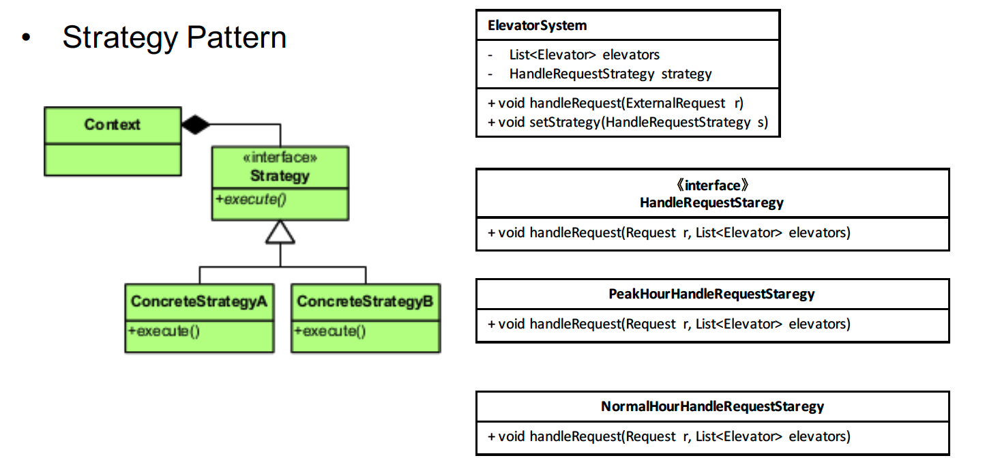
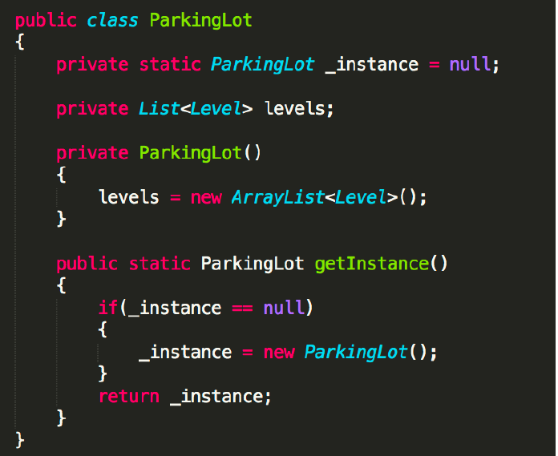
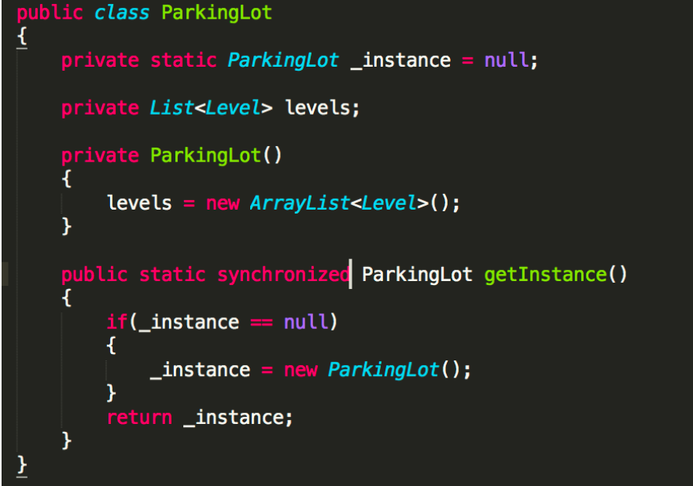
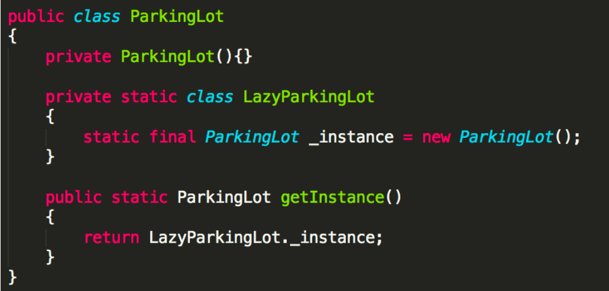

# Design Pattern

### 1. Strategy Design Pattern
- 考虑多种替换
- 封装 多种算法/策略

- 管理类题目：处理payment
  

### 2. Singleton
- ensure a calss has only one instance, and provide a global point of access to it
- 基本式
  
- 线程安全式
  
- 静态内部类式
  

### 3. State Design Pattern
### 4. Decor Design Pattern
