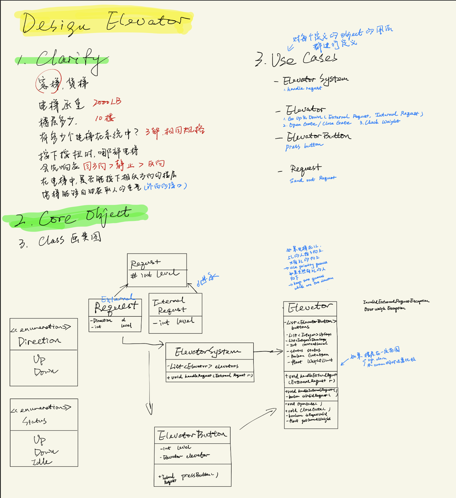

# OOD基础
- access modifier
  - protected: 开放给 我自己 + 子类
  - public: 开放给 所有人
  - private: 开放给 我自己
  - override: 重写父类函数
  - overlode: input args不同 重载
- 封装 encapsulation
    ```java
    class Animal {}
    Animal a = new Animal();
    class Dog extned
    ```
- 继承 inheritence
    ```java
    class Dog extends Animal {}
    ```
    protected, public可以继承， 可以override或者overload

- 多态 polymorphism
    ```Java
    abstract class Animal{
        public abstract void makeSound();
    }
    final class Dog extends Animal{
        public void makeSound(){
            System.out.println('Woof!')
        }
    }
    final class Cat extends Animal{
        public void makeSound(){
            System.out.println('Meeow!')
        }
    }
    Animal animal1 = new Dog();
    Animal animal2 = new Cat();
    <!-- 会有不同的表现 -->
    animal1.makeSound();
    animal2.makeSound();
    ```
- Example: 
    ```java
    class Animal {
        public void description(){
            System.out.println("A general Animal Object")
        }
        protected String name; // 子类可以继承
        private String privacy; //只能自己用
        public int id; //所有都有access
    }

    Animal a = new Animal();
    class Dog extends Animal {}; //继承
    Dog dog = new Dog();
    dog.description();

    class Cat extends Animal {
        //overide
        public void description(){
            System.out.println("A cat Object")
        }
    }

    class Bear extends Animcal {
        public void description(){
            super(); // call the base class's description
        }
    }
    ```

    ```java
    abstract class Animal{}
    class Dog extends Animal{}
    Animal animal = new Animal(); //this is wrong
    Dog dog = new Dog(); // this correct
    ```

    Interface 像是方法的集合，没有constructor
    ```Java
    interface Service{
        // No constructor
        public void serve();
        public void retire();
    }

    class Dog implements Service{
        public void serve()
        pbulic void retire()
    }
    ```

- Exception
  - Checked Exception(10 Exception, compile time exception)
  - Unchecked Exception(Runtime Exception, NPE)
  ```Java
  class MyException extends Exception{ //继承系统的exception
      public MyExcpetion(String s){
          super(s);
      }
  }

  public class Testing{
      public void test(){
          try{
              throw new MyException("My exception");
          }
          catch (MyException ex){
              System.out.println(ex.getMessage());
          }
      }
  }
  ```

- Enum
  
  ```Java
  public enum TrafficSignal{
      RED, YELLOW, GREEN
  }
  public class Testing{
      TrafficSignal signal = new TrafficSignal.RED;
  }
  ```

# 分析方法

- Clarify: 去除歧义， 确定答题范围
  - What: 题目关键字，属性，特点，功能
  - How: 功能
  - Who: 谁在使用
- Core Object: 确定题目所涉及的类，以及类之间的映射关系
  - Package:  如果什么都不声明， 变量和函数都是package level visible的，在同一个package内的其他类
  - Public: 如果声明是public，变量和函数都是public level visible的， 任何其他的类都可以访问（+）
  - Private: 如果声明是private，变量和函数都是class level visible的，仅有定义这些变量和函数的类自己可以访问（封装）
  - Protected: 如果声明是protected，变量和函数在能被定义他们的类访问的基础上，还能被该类的子类所访问（继承）（#）
- Cases: 确定题目中所需要实现的场景和功能
	- 要实现的功能放在白纸黑字上use cases
- Class(UML类图): 通过类图的方式，具体填充题目中涉及的类
	- 遍历你所列出的use cases
	- 对于每个use case 更加详细描述use case在做什么事情
	- 针对这个描述，在已有的core objects里填充进所需要的信息
- Correctness: 检查自己的设计，是否满足关键点

# 分析原则 - SOLID

1. S - Single responsibility principle 单一责任原则
   
   一个类应该有且只有一个去改变他的理由，一个类应该只有一项工作
2. O - Open close principle 开放封闭原则

    对象或实体应该对扩展开放，对修改封闭，open to extension, close to modification

3. L - Liskov subsitution Principle 里氏替换原则
   
    任何一个子类或派生类应该可以替换他们的基类或父类

4. I - Interface segregation Principle 接口分离原则
   
   不应该强迫一个类实现它用不上的接口
   
5. D - Dependency Inbersion Principle 依赖反转原则
   
   抽象不应该依赖于具体实现，具体实现应该依赖于抽象

# Good Practice

1. Raise Exception

# Design Pattern

### 1. Strategy Design Pattern
- 考虑多种替换
- 封装 多种算法/策略


- 管理类题目：处理payment
  


### 2. Singleton
- ensure a calss has only one instance, and provide a global point of access to it
- 基本式
  
- 线程安全式
  
- 静态内部类式
  

### 3. State Design Pattern
### 4. Decor Design Pattern

context -> 

# 题目类型

### 1. 管理类

- 预定：

- LRU Cache: 搜索 》 预定 LinkedHashMap

### 1. clarify

名词， 所有的属性，管理的名词,

1. Parking Lot
2. Vehicle


### 2. Core Object

- 主体
- 什么是input/output

### 3. Use Case

从管理员角度出发
- Reserve
- Serve
- CheckOut

### 4. Class

- 使用收据的形式来保管信息

    例子：图书馆。 User/Book/Recipt


# 2. 实物类 

- Vending Machine
- Jukebox
- CD player
- ATM machine
- Coffee Maker

技巧：

- 可以运用很多的design pattern


# 3. 棋牌类

- 玩家
- 规则
- 胜负
- 积分


- 棋牌类术语 board，suit， hand,
- 棋牌类状态：initialization， play， win/lose check + tie 流局

-----


# Case 1: Elevator



# Case 2: Design Parking Lot

### 1. Clarify

What: Parking lot size? level? / Vehicle type? / Parking Spot type/disabled/electric car?

how: how to park the car? design the specific spot for certain car/ car spot can be combined

How: how to park? new car come in -> return an available spot -> a new spot was occupied by the new car-> need to show the number of available spots? -> free or paid pay by day/hour?


### 2. Core Object

- Parking lot
- Vehicle (Car, bus, motorcycle)
- Parking Spot ()


### 3. Use Case

- Parking Lot
    - Get Available count
    - Park Vehicle
    - Clear Spot
    - Calculate price

- Serve: Park vehicle
- Checkout: Clear Spot + Calculate price


### 4. Class


- Vehicle
    - #int size
    - +int getSize()  

- Bus
    - +int size

- Car
    - +int size

- Motorcycle
    - +int size

- Parkinglot
    - -List(Level) levels
    - -float HourlyRate
    - +int getAvailableCount
    - -List(Spot)findSpot(Vehcle v)
    - +void ParkVehicle(Vechicle v)
    - +void clearspot(ticket t)
    - float calculatePrice(Ticket t)

- Level
    - -List(Spot) spots
    - -int availableCount
    - +int getAvailableCount()
    - +void updateAvailableCount()
    
    
- Spot
    - -boolean available
    - Level I
    - +boolean isAvaiable()
    - +void takeSpot()
    - +void leaveSpot()
    
    
- Ticket
    - -vehicle
    - List(Spot)spots
    - Time startTime


- ParkingLotFullExpception
- 

# Case 3: Restaurant Reservation

### 1. Clarify

- What
- Who
- How

### 2. Core Object
- Restaurant
- Table
- Order
- Meal
- Party
### 3. Cases
- Find Table
- Take Order
- Checkout
- Reservation: Select / Search / Canceel
### 4. Class

- Party
    - -int capacity
    - -int getcapacity

- Restaurant
    - List(Tables)tables
    - List(Meal) menu
    - Map(Table, List(orders)) orders
    + table findtable()
    + void takeorder(order o)
    + void checkout(order o)

- Table
    - int capacity
    - Boolean Available
    + boolean isAvailable()
    + void makeUnavalable()
    + void makeAvailable()
    + int Getcapacity()

- Order
    - List(Meal) meals
    - table t
    - party p
    + float getPrice

- Meal
    - -float price
    - float getPrice


- NoTableException

### 5. Correction

# Case 4: Hotel Reservation

### 1. Clarify

- What: Search criteria -> Search() -> List(Result) -> Select() -> Cancel


### 3. Use  Case
- Search for available rooms
- Make Reservation
- Cancel Reservation


### 4. Class
- Request


- Hotel


- RoomType


- Room
    - int capacity
    - float price
    
    
-     
    
    

# Case 5: Vending Machine 

### 1. Clarify

- Who: Payment(coin, cash, credit card, ), item, 
- What: 
- How: select the item, refill

### 2. Core Object
    
- Vending Machine
- Item
- Coin
    
### 3. Use  Case

- Select item
- Insert the coin
- execute transaction
- cancel transaction
- refill item

### 4. Class
- VendingMachine
    - -List(coins) coins 
    - -List(items) items
    - -Map(string, iteminfo) itemIdentifier
    - -Map(iteminfo, list(item)) items
    - -iteminfo currentSelection
    - -list(coin) currentcoins
    - -state state
    - +float selectitem(string selection)
    - +float insertCoin(List(coin) coins)
    - +pair(item, list(coin)) executeTransaction()
    - -List(coin) refund()
    - -list(coin) cancelitem()
    + void refillItems(list(item) items)
    + void setState(State s)
    
    
- item
    

- coin enumerrationi
    - penny
    - nickle
    - dime 
    - quarter
    - float value

- sprite


- coke


- mountaindew


- iteminfo
    - -float price
    - +float getPrice()
    
- State Interface
    
    
 - NotEnoughMoneyException
 - NotEnoughItemException
 
 
 # Case 6: Coffee Maker
 
 
 
# Case 7: Tic Tac Toe


- TicTacToe
    - -Board board
    - -char currentMove
    - +makeMove(int row, int col)
    - -void changePlayer()

- Board
    - -char[][] board
    - +void initializeboard()
    - +void makeMove(int row, int col, char currentMove)
    - +boolean checkWin()
    - +boolean isBoardFull()


```python

```
