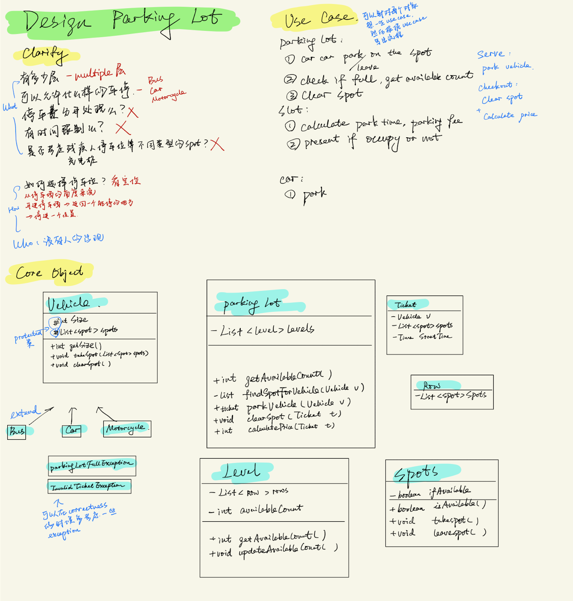

- 管理类
  - [Design Elevator](#design-elevator)
  - [Design Parking Lot](#design-elevator)

- 预定类
  - 解题思路
    - what：考虑预定的东西，例如机票(机舱/座位号)
    - Use Case: Search / Select / Cancel  
      - Search Criteria -> Search() -> Result List -> Select() -> Receipt
      - 
  - [Restaurant Reservation](#design-restaurant-reservation)
  - [Hotel Reservation](#design-hotel-reservation)
  - [Airline Ticket Reservation](#airline-ticket-reservation)

- 实物类
  - 考虑对于实物的输入输出
  - [Vending Machine](#vending-machine)
  - [Coffee Makere](#coffee-maker)
  - [Juke Box](#juke-box)

- 棋牌类
  - [Tic Tac Toe](#tic-tac-toe)
  - [Black Jack](#black-jack)
  - [Chinese Chess](#chinese-chess)
  

# Design Elevator

# Design Parking Lot

# Design Restaurant Reservation

# Design Hotel Reservation

# Airline Ticket Reservation

# Vending Machine

# Juke Box

# Black Jack

# Chinese Chess

# Coffee Maker

# Tic Tac Toe
